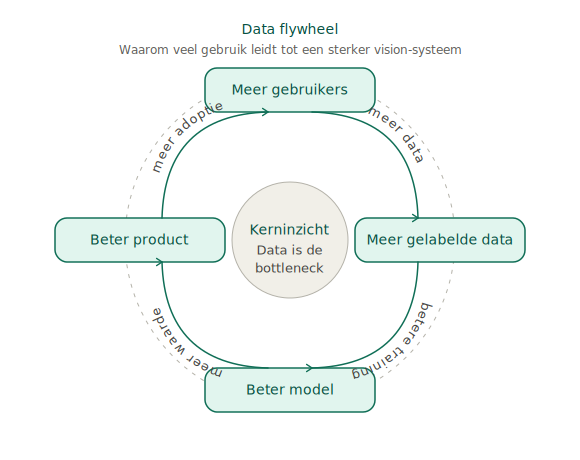
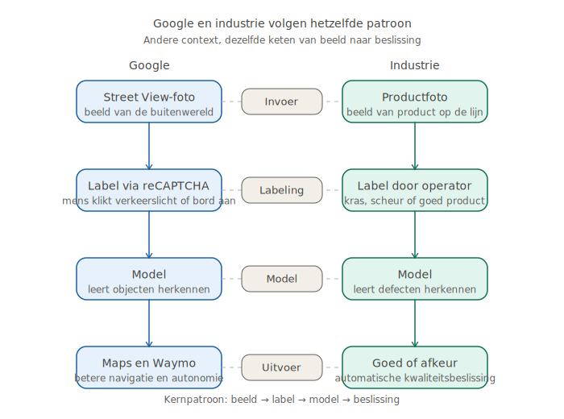

# Workshop 0 — Waarom computer vision?

## Doel van deze workshop

Na deze workshop weten deelnemers:

- Waarom gelabelde data de echte bottleneck is bij computer vision — niet het model
- Hoe het reCAPTCHA-verhaal laat zien hoe een data flywheel werkt op mondiale schaal
- Welk architectuurpatroon ten grondslag ligt aan zowel Google Maps als industriele kwaliteitscontrole
- Wat de ethische vragen zijn rondom het onbetaald verzamelen van trainingsdata
- Waarom "goede data, goed gelabeld" hun eerste uitdaging wordt in de praktijkworkshops

---

## Benodigdheden

- Ruimte met projectiemogelijkheid
- Whiteboard of flipover
- Deelnemers hebben niets nodig behalve hun aandacht

---

## Tijdsindeling (60 min)

| Blok | Inhoud | Duur |
|------|--------|------|
| 1 | Openingsvraag + reCAPTCHA-verhaal | 15 min |
| 2 | Uitleg: wat is er echt gebeurd? | 10 min |
| 3 | Groepsopdracht: het architectuurpatroon | 10 min |
| 4 | Van Google naar de fabriek | 10 min |
| 5 | Ethische discussie | 10 min |
| 6 | Afsluiting: brug naar de praktijkworkshops | 5 min |

---

## Blok 1 — Openingsvraag (15 min)

### Startvraag aan de groep

Stel de volgende vraag, zonder uitleg vooraf:

> "Wie heeft ooit een CAPTCHA ingevuld? Die test waarbij je moet aanklikken op de afbeeldingen met een verkeerslicht, of een zebrapad, of een winkelgevel?"

Laat handen opsteken. Vrijwel iedereen heeft dit gedaan.

> "Wist je dat je op dat moment gratis AI-trainingsdata aan Google gaf?"

Laat dit even landen. Reacties zijn welkom.

---

### Het verhaal (vertellen, niet voorlezen)

**Achtergrond voor de docent — vertel dit in eigen woorden:**

In 2009 kocht Google het systeem reCAPTCHA op. Tot dan toe moest je verdraaide tekst overtikken om te bewijzen dat je een mens was. Google veranderde dat. Ze vervingen die tekst door foto's — foto's van verkeerslichten, zebrapaden, winkelpuien, borden — en vroegen bezoekers om aan te klikken wat ze zagen.

Het voelde als een simpele verificatiestap. Maar het was veel meer dan dat.

Die foto's kwamen rechtstreeks uit Google Street View. Elke klik die jij maakte, hielp een computersysteem leren om echte objecten in de buitenwereld te herkennen. Miljoenen mensen, over de hele wereld, leerden zonder dat ze het wisten een AI-systeem hoe het moest zien.

Die enorme dataset — opgebouwd door gewone internetgebruikers die dachten dat ze alleen maar hun inbox wilden bereiken — werd de basis voor producten zoals Google Maps en Waymo, het zelfrijdende auto-bedrijf van Google. Waymo is vandaag de dag zo'n 45 miljard dollar waard. Een deel van die waarde is gebouwd op data die miljoenen mensen gratis leverden.

En het verhaal gaat verder. Vandaag de dag zie je vaak helemaal geen afbeeldingsvraag meer bij een reCAPTCHA. Het systeem kijkt naar hoe je je muis beweegt, hoe je scrollt, hoe je klikt. Je gedrag zelf is het bewijs dat je een mens bent. De ironie is groot: door te bewijzen dat je menselijk bent, heb je geholpen systemen te bouwen die menselijk werk willen vervangen.

---

### Discussievraag 1

> "Wat vind je hiervan? Is dit slim, of is dit bedrog?"

Laat 2 of 3 reacties toe. Geen oordeel van de docent — dit komt later terug.

---

## Blok 2 — Wat is er echt gebeurd? (10 min)

### Uitleg: het data flywheel

Schrijf op het whiteboard:

```
Meer gebruikers
    -> Meer gelabelde data
        -> Beter model
            -> Beter product
                -> Meer gebruikers
```

Dit heet een **data flywheel**: een zichzelf versterkende cyclus. Hoe meer mensen het systeem gebruiken, hoe meer trainingsdata er wordt verzameld, hoe beter het model wordt, hoe beter het product wordt, hoe meer mensen het systeem willen gebruiken.

Ondersteunende visual:



Google had al een gigantisch gebruikersbestand. Elke website met een loginformulier had een reCAPTCHA. Daarmee had Google toegang tot een van de grootste gratis labelfabrieken ter wereld.

**Kernpunt:**

> Het model zelf is niet het moeilijke deel. Het moeilijke deel is de data — goed verzameld, goed gelabeld, in grote hoeveelheden.

Dit is misschien wel het belangrijkste inzicht van vandaag. Elk AI-model voor computer vision heeft gelabelde trainingsdata nodig. Zonder die data is het model niets. En gelabelde data kost tijd, aandacht en consistentie.

---

### Vraag aan de groep

> "Stel je bent een bedrijf dat een systeem wil bouwen dat defecten op een productielijn herkent. Waar begin je dan?"

Laat een paar antwoorden komen. Stuur dan bij:

> Niet met het model. Je begint met foto's van die defecten. En die foto's moeten gelabeld zijn: dit is een kras, dit is een deuk, dit is goed.

---

## Blok 3 — Groepsopdracht: het architectuurpatroon (10 min)

### Opdracht

Verdeel de groep in tweetallen of drietallen. Geef ze 5 minuten.

**Opdracht:**

> Teken of schrijf het 'recept' voor het reCAPTCHA-systeem van Google. Welke ingredienten had Google nodig? Wat ging erin, wat kwam eruit?

Laat daarna 2 of 3 groepjes hun antwoord presenteren (max 1 minuut per groepje).

---

### Uitleg na de opdracht

Schrijf op het bord:

```
CAMERA / SENSOR
    -> RAW BEELD
        -> MODEL
            -> BESLISSING
```

En daaronder:

```
TRAININGSDATA (gelabeld)
    -> MODEL WORDT BETER
```

Dit is het architectuurpatroon. Het is hetzelfde bij reCAPTCHA en bij een industrieel kwaliteitssysteem. Alleen de context verschilt.

Ondersteunende visual:



---

## Blok 4 — Van Google naar de fabriek (10 min)

### Parallellen uitleggen

Projecteer of schrijf de volgende vergelijking op het bord:

| | Google (reCAPTCHA / Waymo) | Industrie (kwaliteitscontrole) |
|---|---|---|
| **Input** | Straatfoto's uit Street View | Foto's van producten op de lijn |
| **Labels** | "Dit is een verkeerslicht" | "Dit is een kras" / "Dit is goed" |
| **Model** | CNN / YOLO-achtige architectuur | CNN / YOLO-achtige architectuur |
| **Output** | Herken object in nieuwe foto | Goed / Afkeur beslissing |
| **Schaal** | Miljarden foto's, miljoenen gebruikers | Duizenden foto's, handmatig gelabeld |

**Vertel erbij:**

Het patroon is identiek. De uitdaging is ook identiek: je hebt echt goed gelabelde data nodig voordat het model iets nuttigs kan doen.

Het verschil zit in de schaal. Google had miljoenen gratis labelaars. Als jij een kwaliteitssysteem bouwt voor een productiebedrijf in de Achterhoek, moet je die data zelf verzamelen. En dat kost tijd.

**Concreet voorbeeld:**

Stel: een bedrijf maakt metalen beugels. Soms zit er een kras op, soms een scheurtje, soms een verkeerde maat. Je wil een camera-systeem dat dat automatisch herkent.

Stap 1 is niet: "download YOLO en train het model". Stap 1 is: maak honderden foto's van die beugels. Label elk beeld. "Kras op positie linksboven." "Geen defect." "Scheurtje langs de rand."

Pas daarna heeft het model iets om van te leren.

---

### Vraag aan de groep

> "Hoe lang denk je dat het duurt om 500 foto's te labelen? En hoeveel foto's heb je minimaal nodig voor een bruikbaar model?"

Laat antwoorden komen. Er is geen exact goed antwoord — maar typisch:
- 500 beelden labelen: 2-6 uur, afhankelijk van complexiteit
- Minimaal bruikbaar: 100-300 beelden per klasse, afhankelijk van variatie

---

## Blok 5 — Ethische discussie (10 min)

### Situatie

Lees de volgende situatie voor:

> Google verzamelde via reCAPTCHA miljoenen gelabelde beelden, aangemaakt door internetgebruikers die dachten dat ze alleen maar een formulier invulden. Die data is gebruikt om producten te bouwen die miljarden waard zijn. De gebruikers hebben daar nooit iets voor gekregen.

### Discussievragen (kies er 1 of 2)

**Vraag A:**
> "Is dit eerlijk? Of is dit gewoon slim zakendoen?"

**Vraag B:**
> "Stel je voor dat jij een app bouwt en jouw gebruikers leveren onbewust data die jou helpt een beter product te maken. Wanneer is dat acceptabel, en wanneer niet?"

**Vraag C:**
> "Wat zou Google anders hebben kunnen doen? Had je gebruikers kunnen betalen, informeren, toestemming kunnen vragen? Wat zijn de voor- en nadelen?"

Leid een korte discussie. Geen oordeel forceren — het doel is nadenken, niet een uitkomst.

---

### Afsluiting van het ethiekblok

Eindig met:

> "In jullie eigen projecten gaan jullie ook data verzamelen en labelen. Jullie doen dat met bewust toestemming, in een duidelijke context. Maar het vraagstuk blijft relevant: wie bezit die data? Wie profiteert ervan? Dat zijn vragen die de industrie nog niet klaar mee is."

---

## Blok 6 — Afsluiting en brug naar de praktijk (5 min)

### Samenvatting

Vat kort samen wat er vandaag aan bod is gekomen:

1. reCAPTCHA was geen simpele beveiligingsstap — het was een systeem om gratis trainingsdata te verzamelen op mondiale schaal
2. Het data flywheel laat zien waarom data een strategisch voordeel is, niet alleen een technisch hulpmiddel
3. Het architectuurpatroon — camera, gelabelde data, model, beslissing — is universeel: van Google Maps tot een productielijncamera
4. Gelabelde data is de echte bottleneck, niet het model
5. Er zijn echte ethische vragen rondom het verzamelen van data, ook bij "gratis" systemen

---

### De brug naar de volgende workshops

> "In de komende workshops gaan jullie zelf door dit proces. Niet op de schaal van Google, maar het principe is precies hetzelfde."

- **Workshop 1** — Je zet je omgeving op en test je eerste camera
- **Workshop 2** — Je draait je eerste object detection met een kant-en-klaar model (YOLO)
- **Workshop 3** — Je traint je eerste eigen model
- **Workshop 4** — Je verzamelt en labelt je eigen dataset en koppelt die terug aan het model

> "De vraag die je straks bij elke stap in je hoofd moet hebben: is mijn data goed genoeg? Want als de data niet klopt, klopt het model ook niet."

---

## Bijlage: kernbegrippen voor studenten

| Begriff | Uitleg |
|---------|--------|
| **Computer vision** | AI-techniek waarbij een model afbeeldingen of video interpreteert |
| **Trainingsdata** | Voorbeeldbeelden waarop een model leert wat het moet herkennen |
| **Label** | Een aanduiding bij een beeld die zegt wat er te zien is ("kras", "goed", "verkeerslicht") |
| **Data flywheel** | Zichzelf versterkende cyclus: meer data leidt tot beter model, beter model leidt tot meer gebruik, meer gebruik levert meer data op |
| **YOLO** | You Only Look Once — een veelgebruikte architectuur voor real-time object detection |
| **Bounding box** | Rechthoek om een object in een beeld, die aangeeft waar het zich bevindt |
| **Inferentie** | Het moment waarop een getraind model een nieuw beeld beoordeelt |

---

*Workshop ontwikkeld voor de AI Vision Learning Community — reeks computer vision als kwaliteitscontrole.*
